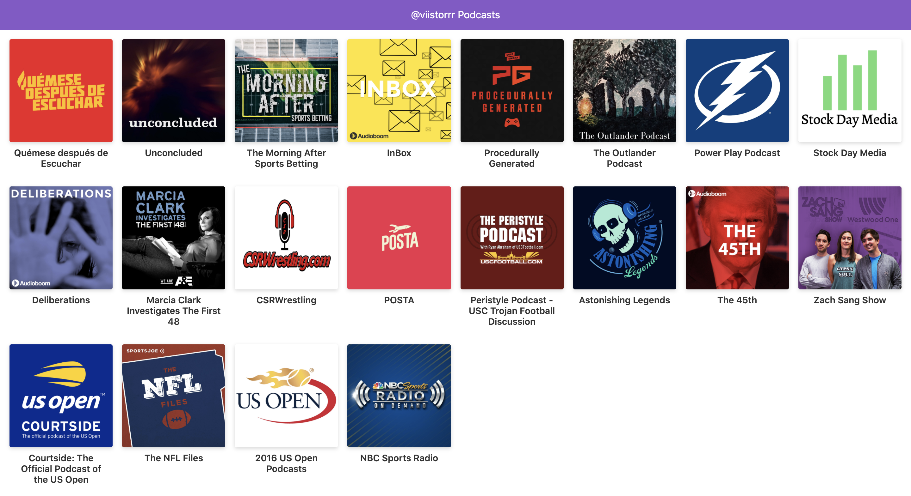

#App de @viistorrr Podcasts del curso de NextJS 2018

App de podcast integrada con la API de AudioBoom para aprender NextJS

##Como funciona?

Requiere NodeJS

- `npm install` para instalar dependencias
- `npm run dev` para el entorno de desarrollo
- `npm run build && npm start` para entorno de produccion

##Licencia

MIT
